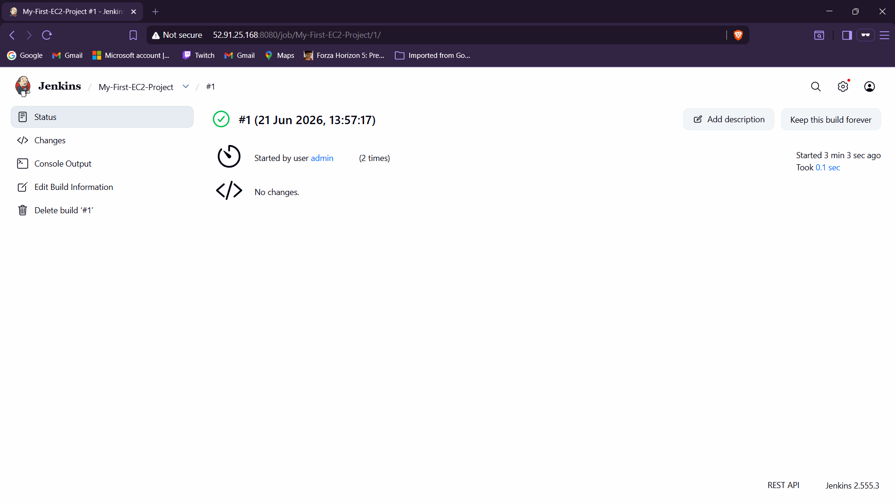
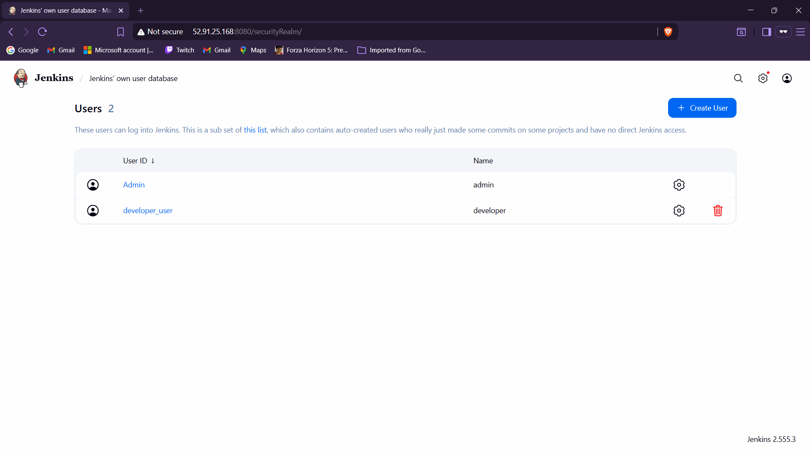

# Cloud Infrastructure Automation: Jenkins Deployment on AWS EC2

A comprehensive, hands-on implementation demonstrating the deployment, optimization, and administration of a Jenkins Continuous Integration (CI) server hosted on an Amazon Web Services (AWS) EC2 cloud instance. This repository serves as practical validation of cloud provisioning, pipeline execution, and role-based access control (RBAC).

---

## 🛠️ Infrastructure & Tech Stack
* **Cloud Platform:** Amazon Web Services (AWS)
* **Compute Instance:** EC2 (`t2.micro` running Ubuntu 24.04 LTS)
* **Automation Server:** Jenkins (v2.555.3)
* **Runtime Environment:** OpenJDK 21 (LTS)
* **Network Configuration:** Custom AWS Security Groups allowing ingress on Port 22 (SSH) and Port 8080 (Web UI)

---

## 🚀 Key Features Implemented

### 1. Cloud Architecture Provisioning
* Successfully deployed an Ubuntu server via the AWS console.
* Configured inbound network security policies to securely expose the web portal.
* Resolved modern Jenkins baseline dependency conflicts by upgrading the environment architecture to **Java 21**.

### 2. Pipeline Automation (Freestyle Project)
* Established an automated workspace build job named `My-First-EC2-Project`.
* Handled advanced system optimization by dynamically adjusting **Built-In Node Executor Thresholds** (allocating 2 active executors) to instantly resolve queue stalls.
* Executed a programmatic deployment script via an embedded bash shell.

### 3. Identity & Access Management (IAM)
* Hardened user access security by setting up a local database realm.
* Provisioned independent execution profiles, creating an administrative tier alongside a secondary restricted `developer_user` profile.

---

## 📸 Verification & Output Artifacts

### 1. Build Execution Log (Console Output)
The freestyle automation project executes the target shell script natively on the EC2 runner, displaying our custom automation string and completing with a perfect termination status (`SUCCESS`).

### 2. User Administration Matrix
Verification of user database profiling, showcasing active permission isolation with the master administrator running alongside the newly provisioned developer workspace profile.

